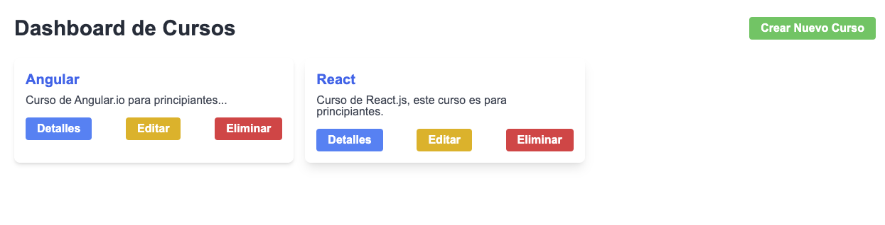
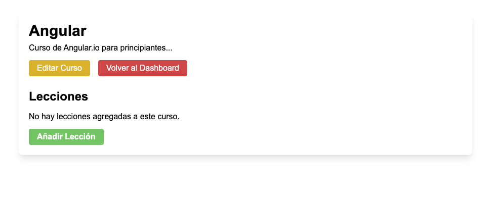
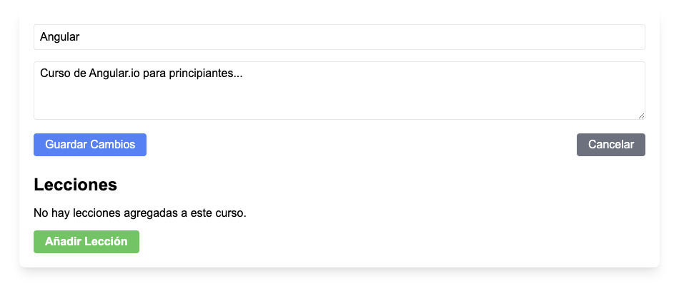
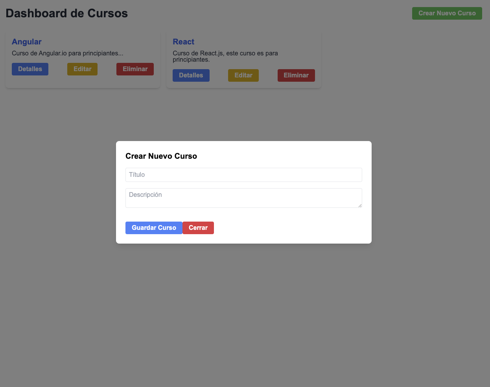

# E-Learning Frontend

Este proyecto, `e-learning-frontend`, es una aplicación web diseñada para plataformas de aprendizaje electrónico. Permite a los usuarios ver y administrar cursos y sus respectivas lecciones.

## Tecnologías Utilizadas

- **React**: Una biblioteca de JavaScript para construir interfaces de usuario.
- **React Router Dom**: Para la navegación entre las páginas del Dashboard y los Detalles del Curso.
- **Tailwind CSS**: Un framework CSS para estilizar la aplicación.
- **Vite**: Como herramienta de construcción y desarrollo que proporciona un entorno de desarrollo rápido y un conjunto de herramientas de construcción optimizadas.
- **ESLint**: Para mantener la calidad del código y seguir las mejores prácticas de codificación.

## Instalación y Ejecución

Para ejecutar este proyecto en su entorno local, siga estos pasos:

1. Clone el repositorio en su máquina local.
2. Navegue al directorio del proyecto y ejecute `npm install` para instalar las dependencias.
3. Una vez que la instalación esté completa, puede iniciar el servidor de desarrollo con `npm run dev`.
4. Para construir la versión de producción, ejecute `npm run build`.

### Scripts Disponibles

- `npm run dev`: Ejecuta la aplicación en modo de desarrollo.
- `npm run build`: Construye la aplicación para la producción en la carpeta `dist`.
- `npm run lint`: Ejecuta ESLint para identificar problemas en el código.
- `npm run preview`: Previsualiza la versión de producción localmente.

## Estructura del Proyecto

La aplicación está estructurada en varias páginas principales ubicadas en la carpeta `src/pages`, y los componentes reutilizables se encuentran dentro de `src/components`. Además, la lógica de interacción con la API se maneja en la carpeta `src/utils`.

## Capturas de Pantalla

Aquí hay algunas capturas de pantalla que ilustran los distintos aspectos de la aplicación:

Para más detalles sobre la implementación y el uso de la aplicación, consulte la documentación de cada librería o herramienta mencionada.
